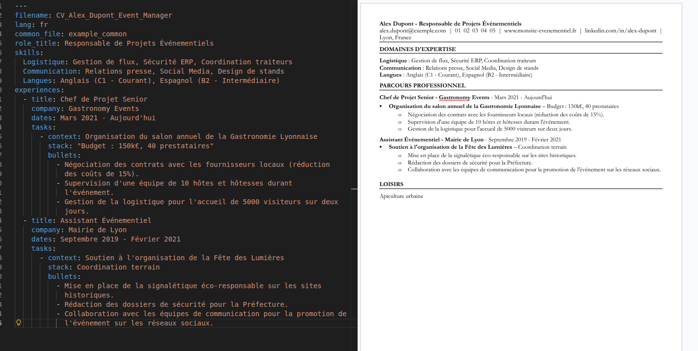

# Resume-as-Code

An automated Python pipeline to generate professional resumes from YAML data files and Microsoft Word (.docx) templates. The system supports multiple workflow strategies from local editing to cloud synchronization.


*Example of a YAML definition transformed into a professional ATS-ready Word document.*

## Features
- **Data-Driven**: Content is stored in `.yml` files for clean versioning and separation of concerns.
- **Flexible Workflow**: Supports local templates, Google Drive (via Service Account), or OneDrive (planned).
- **Bulk Generation**: Generates all resumes defined in the `resumes/` directory in a single execution.
- **ATS Ready**: Outputs standard `.docx` files optimized for Applicant Tracking Systems.

---

## Quick Start

### 1. Prerequisites
- **Python 3.12+**
- **uv** (Modern Python package manager)
- (Optional) **Google Cloud Service Account** if using GDrive synchronization.

### 2. Installation
```bash
# Clone the repository
git clone <your-repo-url>
cd Resume-as-code

# Install dependencies
make install
```

### 3. Usage Strategies
You can manage your template in three ways by editing `config.yml`:

* **Cloud Sync (GDrive/OneDrive)**: Automatically download the latest version before generation. Requires credentials in `secrets/`.
* **Direct Cloud Editing**: Edit your template directly in Google Docs or Word Online, then manually save it to the `templates/` folder.
* **Local-first**: Edit your template locally using Word or LibreOffice and store it in `templates/`.

### 4. Commands
```bash
# Run the full pipeline
make run

# Run unit tests
make test

# Clean build artifacts
make clean
```

---

## Configuration & Secrets
1. **Secrets (Optional)**: If using GDrive, copy `secrets/service_account.json.example` to `secrets/service_account.json` and add your keys.
2. **Environment**: Create a `.env` file at the root to point to your credentials:
   ```env
   GOOGLE_APPLICATION_CREDENTIALS=secrets/service_account.json
   ```
3. **Project Settings**: Update `config.yml` to switch between `source: gdrive` or `source: local`.

---

## Project Structure
- `src/`: Core generation logic.
- `loaders/`: Connectors for external sources (GDrive, OneDrive).
- `commons/`: Global YAML data (Contact information, headers).
- `resumes/`: Specific YAML data (Experience and skills per role).
- `templates/`: Directory for the reference `.docx` templates.
- `dist/`: Generated resumes.
- `secrets/`: Secure storage for API keys (Git ignored).

---

## Technical Workflow
1. The `main.py` script initializes the environment and checks the `config.yml` strategy.
2. If configured for cloud, the relevant connector fetches the latest template.
3. `CVGenerator` merges global data from `commons/*.yml` with each file in `resumes/*.yml`.
4. Final resumes are exported as `.docx` files in the `dist/` directory.

---

## License
MIT
